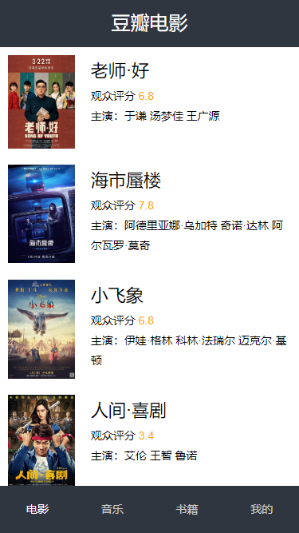
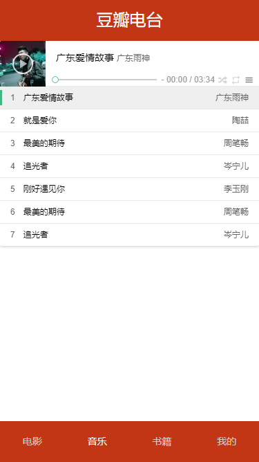

# 仿豆瓣电影简单SPA
学过Vue之后还没动手做过什么移动端项目，一直在官网看Guide。纸上得来终觉浅，绝知此事要躬行，最近几天就拿vue写了个小项目。  
为什么是豆瓣，而不是猫眼，淘票票？因为目前开放的API就属豆瓣电影介绍的最为详细，虽然官方已经不再公开，但是GitHub上备份API地址和备份文档都非常好找。
## 技术栈
vue2 + vuex + vue-router + axios + webpack + ES6  + sass + flex 
## 项目运行
```
git clone https://github.com/xc233/db-spa-vuejs.git

cd db-spa-vuejs

npm install

npm run serve
```
## 接口数据
豆瓣API，从网络获取，并非本人抓取。侵删。


## 部分截图
### 电影界面


### 音乐界面




## Customize configuration
See [Configuration Reference](https://cli.vuejs.org/config/).
